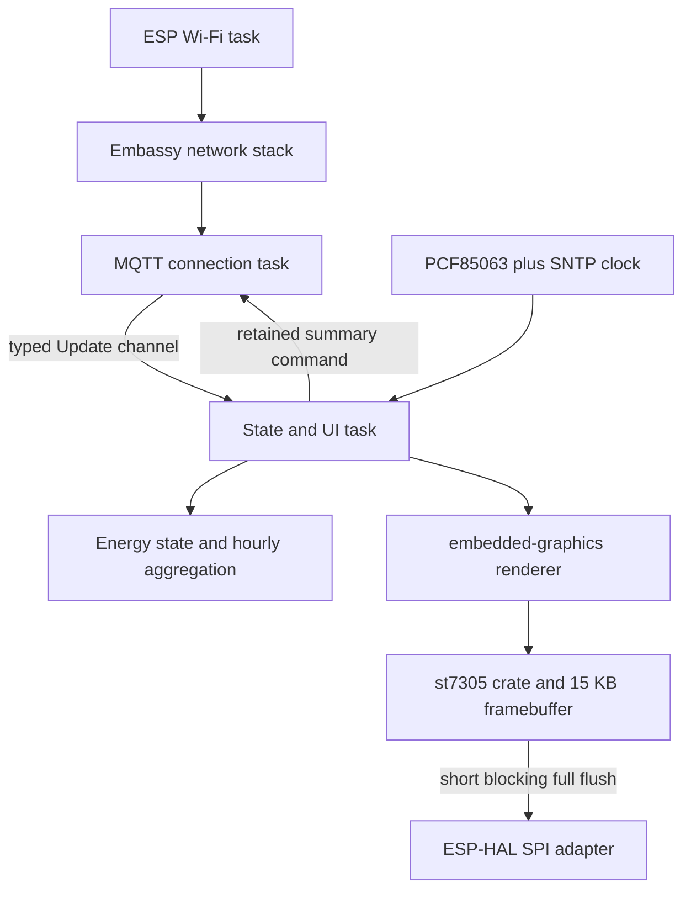

# ESP32-S3 RLCD Energy Dashboard Port Plan

## 1. Goal

Port the production dashboard in `../inky-solar` to the Waveshare ESP32-S3-RLCD-4.2 using:

- bare-metal Rust on `xtensa-esp32s3-none-elf`;
- Embassy for async execution, timing, and networking;
- `esp-hal` for ESP32-S3 hardware and `esp-rtos` for Embassy integration;
- `esp-radio` for ESP32-S3 Wi-Fi;
- `embedded-graphics` for the complete 400×300 user interface;
- the existing `st7305` crate for the panel framebuffer, controller initialization, and SPI flushes.

The target must reproduce the active `Style::Advanced` dashboard, including the optional split home/garage solar display, while preserving the existing MQTT topic and payload contract.

The RLCD is not e-paper. The port will not contain refresh LUT selection, busy-pin waits, clean-screen cycles, periodic full-refresh counters, deep sleep after each frame, or the source's 30-second e-paper update gate. A valid state change may be rendered immediately.

## Completed milestone — M0 board support

Implementation starts with hardware proof, before source fixtures, networking, or dashboard parity work. The first milestone is intentionally limited to one bare-metal firmware binary that proves the toolchain, boot path, board pin map, SPI transport, ST7305 initialization, framebuffer polarity, orientation, text rendering, and serial diagnostics.

**Status (2026-09-09):** complete. The same simulator frame was rendered successfully on the physical panel, confirming the toolchain, SPI transport, framebuffer polarity, orientation, and display controller integration.

## Current milestone — Wi-Fi and live MQTT integration

The workspace includes `crates/dashboard-core`, a `no_std` implementation of the active model, exact live MQTT topic/payload decoding, corrected explicit-time hourly aggregation, allocation-free formatting, and the complete Advanced dashboard geometry/graph. Simulator tests render the source `inkytool test` fixture. Live simulator and firmware both start with an empty model and feed the same renderer from live MQTT updates.

Bitter Pro Black parity is complete: the shared renderer uses `cosmic-text` 0.19 in `no_std + alloc` mode with the source font sizes, advanced shaping, monochrome threshold, alignment, and ink-bound vertical centering. Nix derives a metadata-preserving subset containing printable ASCII plus `°`, `↑`, and `↓` before embedding the font. The source's Font Awesome Pro asset was not copied because its redistribution terms are not documented in the source checkout. The grid, solar, heating, shower, and center backup-heater symbols use the Apache-2.0 Material Design Icons `lightning-bolt`, `solar-power-variant-outline`, `heating-coil`, `shower-head`, and `recycle-variant` glyphs, subset from the Nixpkgs font during environment construction; other monochrome symbols retain their local geometry.

Wi-Fi and live MQTT integration are implemented in software using the `esp-hal-v1.2.0` release-tagged `esp-radio`, Embassy DHCP/TCP, and `rust-mqtt` 0.5.1. Credentials come from a required Secretspec keyring profile and are embedded at build time. Network and MQTT tasks reconnect independently, all large protocol buffers are statically bounded, and accepted publications cross an eight-entry typed `Update` channel to the sole display/model owner. The live host simulator replaces only the ESP Wi-Fi driver with `embassy-net-tuntap`; it retains Embassy's executor, network stack and timing, the shared MQTT session, typed channel, model, and renderer. Hardware acceptance, live wall time, retained summary restore/publication, and long-running memory validation remain outstanding.

### Deliverables

1. Keep `devenv.nix` as the canonical development interface. Every Cargo check/build/run and every flash command must execute through a checked-in `devenv` task or from `devenv shell`; do not rely on an ambient Rust installation.
2. Provision Espressif Rust `1.97.0.0` with `espup` in the ignored devenv state directory and expose pinned `espflash`/`rustup` packages from Nix.
3. Keep the firmware renderer in a shared `no_std` library and provide a native display simulator for local UI iteration. Add `dashboard-core` and font tooling when their milestones begin rather than creating empty crates.
4. Pin the bring-up dependency set, including `esp-hal = 1.2.0`, `esp-rtos = 0.4.0`, and `st7305 = 0.1.2`.
5. Boot the Embassy executor, initialize serial diagnostics, and emit a five-second heartbeat.
6. Configure SPI2 mode 0, MSB first, at 10 MHz with SCLK GPIO11, MOSI GPIO12, D/C GPIO5, CS GPIO40, and RESET GPIO41. Leave TE GPIO6 disconnected from firmware behavior.
7. Initialize the published `st7305` crate unchanged, explicitly select 400×300 landscape, clear to physical white, render a black border and centered hardware-check text, then perform one synchronous full-frame flush.
8. Document build, flash, monitor, expected serial output, expected panel content, and troubleshooting in `README.md`.

The expected panel text is:

```text
ENERGY DISPLAY
ESP32-S3 + ST7305 OK
400x300 landscape / SPI 10 MHz
```

### M0 exit criterion

- `just validate` passes;
- `just build` produces the target release image;
- `just flash` boots without panic;
- serial reports `display hardware check rendered` and continues heartbeats;
- the physical panel has a stable white background, complete black border, and readable left-to-right text in landscape.

The software scaffold is part of this milestone; physical flash/panel confirmation remains a required hardware acceptance step. If the panel fails while serial remains healthy, compare the command stream with `.board-reference`, especially vendor command `0x62`, before changing the architecture or increasing SPI speed.

## 2. Confirmed baseline

### Source application

The production path in `../inky-solar` consists of:

- `src/displaycontroller.rs`: MQTT routing, state ownership, summary restore/publish, and display scheduling;
- `src/solarstatus.rs`: wire payloads and hourly energy aggregation;
- `src/imagegen.rs`: 400×300 advanced layout, formatting, graphing, and text rendering;
- `src/font.rs`: runtime OTF loading through `cosmic-text`;
- `src/mqtt.rs`: Tokio/`rumqttc` MQTT v5 client;
- `src/output.rs` and `inky-what/`: Raspberry Pi/e-paper output;
- `src/structured_log.rs`: optional host-side network logging.

The reusable parts are the wire schemas, topic routing, state calculations, formatting rules, layout geometry, graph calculations, icon choices, and `cosmic-text` font pipeline. `cosmic-text` is reused with its `no_std` and `swash` features; Tokio, `rumqttc`, `chrono::Local`, `anyhow`, CLI parsing, Linux logging, and the Inky driver must be replaced.

### Target hardware

From `.board-reference`:

| Property | Value |
|---|---|
| Board | Waveshare ESP32-S3-RLCD-4.2 |
| Module | ESP32-S3-WROOM-1-N16R8 |
| Flash / PSRAM | 16 MB flash / 8 MB octal PSRAM |
| Display controller | ST7305 monochrome reflective LCD |
| Native panel | 300×400 portrait |
| Application coordinates | 400×300 landscape |
| SPI mode | Mode 0, MSB first |
| SCLK | GPIO11 |
| MOSI | GPIO12 |
| D/C | GPIO5 |
| CS | GPIO40, active low |
| RESET | GPIO41, active low |
| Optional TE | GPIO6, not used initially |
| RTC/I²C | PCF85063, SDA GPIO13, SCL GPIO14 |

Start SPI at 10 MHz for bring-up. Raise it to the vendor-demonstrated 24 MHz only after hardware validation.

### Existing Rust display driver

Use [`st7305` 0.1.2](https://crates.io/crates/st7305), pinned exactly during initial bring-up. It is `no_std`, uses `embedded-hal` 1.0, provides an internal 15,000-byte framebuffer, supports the Waveshare 300×400 portrait and 400×300 landscape mappings, and implements `embedded-graphics-core`'s `DrawTarget` behind its `graphics` feature.

Important integration details found in 0.1.2:

- `St7305` owns both the display interface and framebuffer.
- `flush()` sends the complete native framebuffer.
- The `async` feature only makes reset delays asynchronous. Controller command/data writes and `flush()` still use synchronous `display-interface::WriteOnlyDataCommand`.
- A short blocking full flush inside the Embassy app task is acceptable initially: approximately 12 ms at 10 MHz or 5 ms at 24 MHz.
- In the graphics implementation, `embedded_graphics::pixelcolor::BinaryColor::On` sets a controller bit to 1, which is physically **white** with this panel profile; `Off` is physically **black**. A local display wrapper must centralize this polarity.
- The crate's own `st7305::BinaryColor` enum represents framebuffer fill bytes and is distinct from `embedded-graphics`' `BinaryColor`; do not expose that naming collision to renderer code.
- The published initialization sequence uses the mainline voltage profile and 200 ms sleep-out delay, but omits the vendor example's `0x62 [0x32, 0x03, 0x1F]` gate-timing command. Test 0.1.2 unchanged first; if hardware shows a problem, fix or contribute this upstream rather than replacing the whole driver.

Use `display-interface-spi` if it composes cleanly with the selected `esp-hal` SPI type. Otherwise add only a small local `WriteOnlyDataCommand` adapter that owns SPI, D/C, and CS.

## 3. Parity contract

### Preserve

1. Logical resolution and active advanced layout: 400×300.
2. Region dimensions, borders, black/white inversions, graph direction, icons, font sizes, alignment, and value formatting.
3. Normal and split-solar variants.
4. MQTT field names and topics, including the existing misspelling `energy/daylysummary`.
5. Combined home + garage production behavior.
6. Battery data sourced from `energy/solar`, not from the board's battery ADC.
7. Hourly graph data and retained summary interoperability.
8. Plain MQTT credentials and port configuration used by the current deployment unless security requirements are changed separately.

### Intentionally replace

1. Raspberry Pi/Linux startup with ESP32-S3 initialization.
2. Tokio tasks and signals with Embassy tasks, channels, signals, and timers.
3. `rumqttc` with a bounded `no_std` MQTT client over `embassy-net`.
4. The host `cosmic-text` configuration with its `no_std + alloc + swash` configuration while preserving runtime OTF shaping and monochrome rasterization.
5. `chrono::Local` with RTC/SNTP-backed wall time and explicit local-time conversion.
6. E-paper output and refresh policy with direct ST7305 GRAM writes.
7. CLI/environment configuration with embedded configuration/provisioning.
8. Host logging with serial/`defmt` diagnostics.

### Do not port initially

- the unused default dashboard style;
- `inkytool` hardware commands;
- e-paper color modes and yellow/red rendering;
- e-paper cleaning, fast/full update modes, LUTs, and busy handling;
- VictoriaLogs structured-log forwarding;
- audio, microphone, SHTC3, SD card, board battery gauge, and buttons;
- TE-synchronized or partial display updates unless measurement later justifies them.

## 4. Target workspace

Grow the workspace incrementally. M0 contains only the root workspace and `firmware`; later milestones add separate host and embedded crates so firmware code remains `no_std` without fragile backend feature combinations.

```text
energydisplay/
├── Cargo.toml                    # workspace
├── .cargo/config.toml
├── config.example.toml
├── crates/
│   └── dashboard-core/           # no_std model, routing, aggregation, renderer
├── firmware/                     # ESP32-S3 Embassy binary and display adapter
├── simulator/                    # std host preview and golden-image harness
├── assets/
│   └── fonts/                    # Font assets and third-party license notices
└── tests/
    └── fixtures/                 # MQTT JSON and expected summaries/images
```

Suggested firmware modules:

```text
firmware/src/
├── main.rs
├── config.rs
├── board.rs
├── clock.rs
├── display.rs                    # st7305 construction, polarity, and clear/flush API
└── tasks/
    ├── net.rs
    ├── mqtt.rs
    └── app.rs
```



The app task should be the sole owner of mutable dashboard state, renderer, and `st7305::St7305` instance. This avoids locks while drawing or flushing. The network stack and MQTT connection run independently and exchange bounded messages with the app task.

## 5. Step-by-step conversion

Complete and physically accept M0 before starting these full-port steps.

### Step 1 — Freeze source behavior and create parity fixtures

1. Build the existing `../inky-solar` simulator.
2. Render the deterministic `inkytool test` state in:
   - advanced normal mode;
   - advanced split-solar mode.
3. Save both 400×300 images as golden references.
4. Threshold the source output to black/white exactly as the Inky backend does.
5. Capture representative payloads for every MQTT topic, including retained summary data.
6. Add edge-state fixtures for zero values, import/export, charge/discharge, battery thresholds, negative temperatures, backup heat, relay inversions, and full 24-hour graphs.
7. Record source formatting at boundaries such as 999 W and 1000 W.

**Exit criterion:** deterministic source images and MQTT fixtures exist, and the expected production behavior no longer depends on visual inspection of the old device.

### Step 2 — Expand the validated Rust/Embassy scaffold

M0 establishes the minimal target with pinned `esp-hal`, `esp-rtos`, Embassy, graphics, and ST7305 dependencies. Preserve that known-good baseline while expanding it:

1. Add `esp-radio`, `embassy-net`, and other dependencies only when their consuming milestones begin, pinning a mutually compatible release set.
2. Add future workspace members only as they gain executable code or tests.
3. Extend checked-in `devenv` tasks for host tests, target checks/builds, formatting, linting, flashing, and serial monitoring. Every build remains inside devenv.
4. Keep `xtensa-esp32s3-none-elf`, linker settings, panic/backtrace support, and the `espflash` runner under version control.
5. Add `config.example.toml` and ignore the real secret-bearing configuration before networking work begins.
6. Preserve the M0 heartbeat as a minimal diagnostic path while higher-level tasks are introduced.

**Exit criterion:** the proven `no_std` Embassy firmware remains buildable and flashable through devenv while the host/test workspace is ready for the next porting steps.

### Step 3 — Integrate and prove the `st7305` crate

1. Add `st7305 = { version = "=0.1.2", features = ["graphics"] }`; enable its `async` feature only if using `init_async` for Embassy-compatible reset delays.
2. Add `display-interface-spi` or a minimal local `WriteOnlyDataCommand` adapter for the selected `esp-hal` SPI type, D/C GPIO5, and CS GPIO40.
3. Configure mode-0, MSB-first SPI on SCLK GPIO11 and MOSI GPIO12, initially at 10 MHz.
4. Construct `St7305` with the display interface and RESET GPIO41, initialize it, and select `Orientation::Landscape` explicitly.
5. Add `firmware/src/display.rs` as a thin wrapper that:
   - names physical `BLACK` as embedded-graphics `BinaryColor::Off`;
   - names physical `WHITE` as embedded-graphics `BinaryColor::On`;
   - hides the crate's separate fill-byte `BinaryColor` enum;
   - performs a direct white `color_clear` before a complete redraw;
   - exposes initialize, clear, draw-target access, full flush, display on/off, and recovery operations.
6. Keep `flush()` synchronous inside the app task. Do not claim or build an async SPI layer unless the crate adds a genuinely async command/data interface.
7. Flush a white buffer or first complete frame immediately after initialization.
8. Do not add e-paper refresh commands, busy waits, LUTs, clean cycles, or partial-update bookkeeping.
9. Pin 0.1.2 while the integration is validated because the crate is new and its public API may change quickly.

Use a recording/fake `WriteOnlyDataCommand` in host tests to observe commands and the private framebuffer when `flush()` sends it. Verify:

- the expected reset and initialization command stream;
- the known difference around vendor command `0x62`;
- full-window commands `0x2A`, `0x2B`, and `0x2C`;
- all four landscape corners;
- clipping, black/white polarity, byte boundaries, rectangles, checkerboards, and known packed bytes;
- that a white clear sends `0xFF` and a black clear sends `0x00` throughout the framebuffer.

Use the M0 bordered text frame as the first hardware bring-up image and test the published crate unchanged at 10 MHz. After text is stable, add a temporary corner/line/checkerboard pattern if needed for packing tests. If the panel fails or shows unstable scan/contrast behavior, compare the command trace with `.board-reference`; prefer an upstream PR or pinned Git revision over a duplicate local driver. After stable bring-up, test 24 MHz.

**Exit criterion:** the pinned crate passes adapter/packing tests and the physical panel shows the stable M0 text frame plus a correctly oriented 400×300 test pattern.

### Step 4 — Port the renderer without `std`

1. Move only the active advanced renderer into `dashboard-core`.
2. Make rendering accept:
   - `&EnergyStatus`;
   - one caller-provided local date/time snapshot;
   - a generic `DrawTarget<Color = BinaryColor>`;
   - the split-solar option.
3. Preserve the source geometry and drawing order.
4. Replace `Canvas<Gray8>` with direct drawing into `st7305::St7305` or a host `MockDisplay<BinaryColor>`, using the wrapper's physical black/white constants.
5. Replace `String`, `Vec`, and `format!` with fixed-capacity `heapless::String` and `core::fmt::Write`.
6. Keep `f64` initially to preserve source parsing and formatting at rounding boundaries. Optimize only after parity tests prove equivalent output.
7. Preserve the source's 1-bit glyph threshold (`alpha > 127`) and vertical centering based on actual rendered glyph bounds.

#### Font and icon conversion

The source uses proportional Bitter Pro Black text and Font Awesome Pro icons through `cosmic-text`; built-in monospaced fonts do not produce an equivalent layout.

**Implemented:**

1. Subset the OFL-licensed Bitter Pro Black OTF to printable ASCII plus `°`, `↑`, and `↓`, preserve its family/weight metadata, and embed the derived OTF in flash.
2. Reuse `cosmic-text` 0.19 with `default-features = false` and features `no_std` and `swash`, rather than maintaining a custom font generator or bitmap renderer.
3. Preserve the source's advanced shaping and sizes: 43 px main values, 32 px split values, 29 px battery values, 23 px subtext, and 18 px status text.
4. Preserve the source's `alpha > 127` monochrome threshold, horizontal alignment, and vertical centering based on actual rendered ink bounds.
5. Back runtime shaping and raster caching with a 256 KiB internal-RAM heap. Do not use ESP32-S3 PSRAM as the global allocator because `cosmic-text` uses `Arc` and its atomic reference counts must reside in internal RAM.
6. Keep the Font Awesome Pro asset out of this repository because the source checkout does not document redistribution permission. Use Nixpkgs' Apache-2.0 `material-design-icons` package for grid `lightning-bolt` (`U+F140B`), solar `solar-power-variant-outline` (`U+F1A74`), heating `heating-coil` (`U+F1AAF`), shower `shower-head` (`U+F09A0`), and center backup-heater `recycle-variant` (`U+F139D`), deriving a five-glyph subset with `pyftsubset` before embedding it. Keep the remaining simple monochrome symbols as local geometry.

**Exit criterion:** Bitter text metrics and rasterization match the thresholded source rendering; licensed font glyphs replace the grid, solar, heating, shower, and backup-heater approximations.

### Step 5 — Port models, routing, and formatting

1. Recreate the MQTT payload structs with `serde` in `no_std` mode and the exact JSON field names.
2. Use bounded JSON parsing, initially with `serde-json-core` or an equivalent allocation-free parser.
3. Define a typed `Update` enum so the MQTT task does not share mutable state with the renderer.
4. Port the exact topic router for:
   - `espaltherma/ATTR`;
   - `home/zigbee/HeatpumpPower`;
   - `home/zigbee/HeatpumpPowerBUH`;
   - `energy/heatpump/status/cop`;
   - `energy/heatpump/status/relay/recommend`;
   - `energy/heatpump/status/relay/force`;
   - `home/zigbee/BuitenSensor`;
   - `energy/solar`;
   - `energy/solar_garage`;
   - `energy/p1/state`;
   - `energy/daylysummary`.
5. Port combined home/garage solar calculations and battery/grid state updates.
6. Add fixture tests for every topic, malformed UTF-8/JSON, missing fields, extra fields, and oversized payloads.
7. Add tests for all formatting and battery icon thresholds.

**Exit criterion:** all captured broker messages parse into the same values and produce the same formatted display strings as the source.

### Step 6 — Implement wall time and hourly history

Wall time is required for the status bar, local-hour graph buckets, day rollover, stale-summary checks, and hourly summary publication.

1. Add an async PCF85063 driver over I²C on GPIO13/GPIO14, or integrate a compatible `embedded-hal-async` crate.
2. Read and validate RTC time at boot.
3. Add SNTP synchronization after Wi-Fi is available.
4. On successful SNTP sync, update the RTC and maintain time from monotonic Embassy time between syncs.
5. Convert UTC to configurable local civil time. Default to `Europe/Brussels` behavior, including CET/CEST, because the source uses Belgian Dutch date formatting.
6. Format `%a %e %b` with static Dutch weekday/month abbreviations and `%H:%M` without a locale runtime.
7. Refactor hourly aggregation to accept an explicit local date/hour rather than reading global time.
8. Preserve the retained summary JSON schema and exact `energy/daylysummary` topic.
9. Serialize into a fixed, tested buffer large enough for all 24-hour arrays.
10. Publish the retained summary once per clock hour from an independent timer, not only when MQTT traffic arrives.
11. During startup summary restore, continue routing normal MQTT messages rather than discarding them.

Recommended correctness fixes, covered by tests:

- track whether an hourly baseline exists instead of treating `0.0` as “unset”;
- set a new baseline immediately after day/hour reset;
- compare complete local dates, including year;
- handle cumulative meter resets without producing negative spikes;
- define behavior for DST skipped/repeated local hours.

**Exit criterion:** RTC-only boot, SNTP correction, midnight rollover, reboot restore, hourly publication, and DST boundary tests behave deterministically.

### Step 7 — Bring up Embassy Wi-Fi and networking

**Software status (2026-09-09):** implemented and target-built; physical DHCP/reconnect acceptance remains pending. The compatible radio stack comes from the readable `esp-hal-v1.2.0` Git release tag because crates.io's identically versioned `esp-radio 1.0.0-beta.0` targets the older `esp-hal 1.1` generation. `Cargo.lock` records the resolved release commit.

1. Initialize ESP32-S3 clocks, RNG, timers, Wi-Fi radio, and Embassy executor resources.
2. Allocate bounded static network resources and socket buffers; avoid placing display/DMA buffers on task stacks.
3. Connect to 2.4 GHz Wi-Fi using configured credentials.
4. Run the Embassy network stack with DHCP and DNS support if broker/NTP hostnames are configured.
5. Implement disconnect detection and capped exponential reconnect backoff.
6. Keep the application/display alive with its most recent state while Wi-Fi is unavailable.
7. Log connection state, IP address, reconnect attempts, and fatal initialization errors over serial.

**Exit criterion:** the board acquires a lease, resolves configured hosts, reconnects after AP loss, and does not leak resources or restart the UI.

### Step 8 — Add bounded async MQTT

**Software status (2026-09-09):** live subscriptions and typed update delivery are implemented and target-built; broker/hardware acceptance and retained summary restore/publication remain pending. The client uses MQTT v5, QoS 2 subscriptions, a 180-second keepalive, one in-flight subscription, bounded receive state, 4 KiB caller-owned TCP buffers, 4 KiB resettable scratch storage, and an eight-entry update channel.

Perform a short dependency spike before committing to a client. The selected `no_std` client must work with `embassy-net` or `embedded-nal-async` and support:

- username/password;
- wildcard subscriptions;
- retained publishes;
- QoS 1 at minimum;
- keepalive/ping;
- reconnect and resubscribe;
- bounded caller-owned RX/TX buffers;
- payloads large enough for the retained energy summary.

Then:

1. Configure broker host, port, client ID, credentials, and a 180-second keepalive.
2. Subscribe to the retained summary and all live topics.
3. Route every incoming publish to a typed update; do not silently swallow transport errors.
4. Resubscribe after each clean reconnection.
5. Send retained summary publications received from the app task.
6. Validate wildcard routing for `energy/heatpump/status/#`.
7. Use backpressure or an explicit latest-value policy rather than unbounded queues.

The source requests QoS 2 for subscriptions, but many embedded clients support only QoS 0/1. Prefer QoS 1 for the firmware unless a proven Embassy-compatible QoS 2 client is available; document this intentional transport-level difference. The dashboard state is idempotent, so duplicate QoS 1 deliveries are safe.

**Exit criterion:** a local broker replay updates all state fields, reconnects cleanly, restores retained history, and publishes a retained compatible summary.

### Step 9 — Integrate the application task

**Software status (2026-09-09):** the main task owns the display, renderer cache, and dashboard model; it redraws immediately for each typed update and retains the last frame through network outages. RTC/SNTP time, the independent one-minute redraw, display recovery, and hardware acceptance remain pending.

1. Initialize and clear the ST7305.
2. Start network, clock, and MQTT tasks.
3. Let one app task own `EnergyStatus`, hourly aggregation, renderer, and the wrapped `st7305::St7305` instance.
4. On every accepted state mutation:
   - update derived state;
   - call the driver's direct white framebuffer clear;
   - re-render the complete 400×300 frame with the crate as the `DrawTarget`;
   - call its synchronous full `flush()` immediately.
5. Add an independent one-minute clock tick so date/time advances even when MQTT is idle.
6. Do not add a 30-second minimum interval or any e-paper refresh counter.
7. It is acceptable to coalesce already-queued state notifications into one latest-state frame, but do not intentionally delay a frame to enforce a refresh rate.
8. On SPI failure, retain state, reinitialize the display with backoff, and redraw.
9. Keep network parsing and SPI flushing out of interrupt context.

At 10 MHz, the raw 15 KB transfer is about 12 ms; at 24 MHz it is about 5 ms. Full-frame updates are therefore the simplest default. Partial dirty-window logic should be added only if measurements reveal a real need.

**Exit criterion:** live broker updates appear on the physical display without an artificial refresh delay, and the clock advances without MQTT traffic.

### Step 10 — Configuration and secrets

Provide a documented configuration surface for:

- Wi-Fi SSID/password;
- MQTT host/port/user/password/client ID;
- NTP server;
- timezone;
- split-solar mode;
- optional SPI frequency and panel profile.

For the first firmware, use a local, gitignored build configuration generated into `OUT_DIR`, with a checked-in `config.example.toml`. Make it clear that credentials are embedded in the flashed binary. NVS provisioning can be a later enhancement if runtime configuration is required.

Remove the source-only `fast_update` and structured-log options.

**Exit criterion:** a clean checkout plus a local config file builds reproducibly without committing secrets.

### Step 11 — Reliability and memory validation

1. Use typed, non-allocating errors in `dashboard-core` and the local display adapter; preserve enough context around the crate's `DisplayError` to diagnose init/flush failures.
2. Use serial/`defmt` logs for network, MQTT, clock, parse, render, and display failures.
3. Bound every channel, string, JSON payload, MQTT packet, and summary buffer.
4. Measure task stack high-water marks or conservatively size static task storage.
5. Keep the 15 KB framebuffer and SPI staging/DMA storage in appropriate static internal RAM.
6. Do not require PSRAM for the first implementation.
7. Verify long-running reconnect loops do not grow memory.
8. Decide watchdog policy after measuring worst-case Wi-Fi reconnect and display-flush operations.

Initial application RAM budget should explicitly account for:

- 15,000-byte native display framebuffer;
- MQTT RX/TX buffers, including retained summary size;
- Embassy network packet/socket buffers;
- typed update and publish channels;
- task stacks;
- approximately 1.2 KB of source-compatible hourly `f64` arrays;
- small text-formatting buffers;
- the 256 KiB internal-RAM heap used by `cosmic-text` shaping and Swash raster caching.

The Bitter Pro OTF belongs in flash. Keep the `cosmic-text` allocator in internal RAM rather than PSRAM because its `Arc` reference counts use atomics.

**Exit criterion:** target build size is recorded, static buffers fit internal memory, and a multi-hour reconnect/update test remains stable.

### Step 12 — Final validation and documentation

Run validation in this order:

1. `dashboard-core` unit tests on the host.
2. `st7305` adapter, command-trace, polarity, and packing tests on the host.
3. MQTT fixture and summary compatibility tests.
4. Golden-image tests for normal and split advanced layouts.
5. Target check and release build through `just validate` and `just build`.
6. Hardware display patterns at 10 MHz.
7. Full dashboard at 10 MHz, then optional 24 MHz validation.
8. Broker integration with retained messages and live updates.
9. Wi-Fi loss/recovery and broker restart.
10. Cold boot with valid RTC but unavailable network.
11. Cold boot with invalid RTC followed by SNTP recovery.
12. Power cycle during the current hourly bucket.
13. Overnight/day rollover test.

Document:

- toolchain installation;
- configuration and secret handling;
- build, flash, and monitor commands;
- pin map and display profile;
- broker topics and payload examples;
- update behavior;
- RTC/SNTP behavior;
- known transport differences from the Raspberry Pi version;
- troubleshooting for panel profile, SPI frequency, Wi-Fi, and time sync.

## 6. Decisions to lock before or during implementation

Unless changed explicitly, use these defaults:

| Decision | Default |
|---|---|
| Development workflow | All build, test, and flash operations run through checked-in devenv tasks or `devenv shell` |
| UI scope | Active advanced layout only |
| Visual behavior | Strict source parity before cosmetic/data-label fixes |
| Solar layout | Configurable normal/split, default matching current deployment |
| Display transfer | Full-frame flush after each accepted update |
| SPI speed | 10 MHz initially; validate 24 MHz later |
| Display driver | Pin `st7305` 0.1.2 with `graphics`; thin local display-interface/polarity adapter |
| Panel initialization | Use the crate's mainline profile and 200 ms sleep-out delay; validate its omitted vendor `0x62` command on hardware |
| TE pin | Unused |
| MQTT transport | Plain TCP, default port 1883 |
| MQTT QoS | QoS 1 if embedded client cannot support source QoS 2 |
| Summary compatibility | Preserve `energy/daylysummary` and its JSON schema |
| Timezone | Europe/Brussels rules with Dutch labels |
| Local persistence | Broker-retained summary first; no flash writes initially |
| Secrets | Gitignored build-time configuration |
| PSRAM | Not required |

Potential visible source bugs should not be silently changed during an “identical” port:

- battery daily energy is labeled `kW` rather than `kWh`;
- units disappear from the advanced top row;
- split home/garage values have no labels;
- simultaneous nonzero import/export chooses inconsistent direction/value precedence;
- unavailable values generally render as zero.

Implement strict visual parity first. Correct these only in a separately reviewed follow-up or behind a deliberate compatibility decision.

## 7. Definition of done

The port is complete when:

1. The ESP32-S3 boots directly into Embassy firmware without ESP-IDF/Arduino runtime dependencies.
2. The pinned `st7305` crate displays a correctly oriented 400×300 black/white frame through the ESP-HAL adapter.
3. Normal and split advanced dashboards match approved source golden images.
4. All existing MQTT topics and payloads update the same dashboard fields.
5. Home and garage production, battery, grid, heat-pump, temperatures, graph, date, and time are present.
6. The retained daily summary restores and publishes compatibly.
7. Every accepted state update can trigger an immediate frame; no e-paper rate limit or clean cycle remains.
8. The clock updates independently of MQTT traffic.
9. Wi-Fi and MQTT reconnect without losing the last displayed state.
10. Host tests and the target release build pass through devenv, followed by physical hardware acceptance tests.
